<!-- Header -->
<p align="center">
  
</p>

<p align="center">
  
</p>

<p align="center">
  <a href="https://github.com/x6py"></a>
  
</p>

<br>

### ✦ About

- 💻 Coding in **C, Python, Java** and loving (almost) every segfault
- 🔐 Into **cybersecurity**: pentest, CTFs, networks, SQL
- 🎯 Goal: write clean code and ship real projects

<br>

### ✦ Experience

```console
x6py@root:~$ cat experience.log
[+] LCL ............................ built a cybersecurity app
                                     for stable API images
[+] GMGN.ai ........................ developer
[+] Roblox ......................... content creator & UGC maker
[+] Community ...................... server with 30k+ members
```

<p align="left">
  
  
  
  
</p>

<br>

### ✦ Socials

<p align="left">
  <a href="https://tiktok.com/@TON_TIKTOK"></a>
  <a href="https://instagram.com/TON_INSTA"></a>
  <a href="https://youtube.com/@TA_CHAINE"></a>
  <a href="https://x.com/TON_X"></a>
  <a href="https://discord.gg/TON_INVITE"></a>
</p>

<br>

### ✦ Tech

**`> dev`**

<p align="left">
  
</p>

**`> cyber`**

<p align="left">
  
</p>
<p align="left">
  
  
  
  
  
  
</p>

**`> tools`**

<p align="left">
  
</p>

<br>

### ✦ Stats

<p align="center">
  
  
</p>

<p align="center">
  
</p>

<!-- Footer -->
<p align="center">
  
</p>
